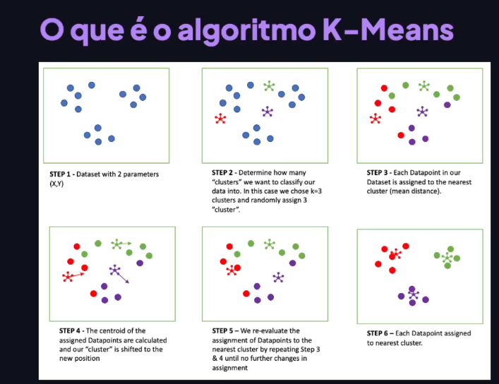
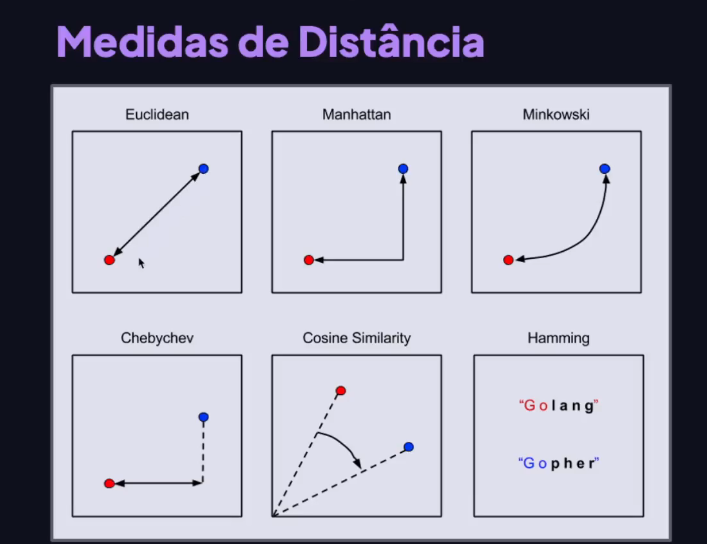

## O que é clusterização?

os algoritmos de clusterização são técnicas de aprendizado de máquina e mineração de dados que agrupam um conjunto de dados em clusters ou grupos, com base na similaridade entre os itens

# Alguns algoritmos:

- Segmentação de mercado: Segmentar clientes com base em caracteristicas.
- Análise de redes sociais: identificar comunidades de usuários com interesses semelhantes.
- Agrupamento de documentos: Agrupar documentos semelhantes

# K-means

Agrupa dados em k clusters, onde k é definido pelo usuário. Ele atribui pontos de dados aos clusters com base na proximidade dos centroides, recalculando-os interativamente para minimizar a variância intra-cluster.

# K-medoids

Variação do K-means que usa medoids (dados reais) como representantes de clusters. Ele atribui medoids inicialmente e, em seguida, reajusta iterativamente, minimizando uma função de dissimilaridade. É mais robusto a outliers.

# Hierárquico Aglomerativo

Começa considerando cada ponto de dado com um cluster separado e, em sequida, mescla iterativamente os clusters mais próximos, formando uma hierarquia de clusters até que todos os pontos estejam em um único cluster.

# Hierárquico Divisivo

Começa considerando todos os pontos de dados em um único cluster e, em seguida, divide iterativamente o cluster em subclusters menores até que cada ponto de dado esteja em seu próprio cluster inidividual.

# e etc...

## O que é o algortimos  K-means?

O algoritmo segue esses passos:

1. Inicialização dos centroides: Começa selecionando aleatoriamente k pontos como centroides iniciais. Esses centroides são representantes dos clusters.
2. Atribuição de Pontos aos Clusters: Cada ponto dado é atrituído ao cluster cujo centŕoide está mais próximo, com base em uma medida de distância, geralmente a distância euclidiana.
3. Atualização dos centroides: os centroides dos clusters são recalculados como a média de todos os pontos atribuídos a esse cluster.
4. Reatribuição de pontos: Os pontos são reatribuídos aos clusters com abse nos novos centroides.
5. Iteração: Os passos 3 e 4 são repetidos até que não haja mudanças significativas na atribuição dos pontos aos clusters ou um número máximo de iterações seja alcançado.

O algoritmo convergue quando os centroides não mudam significativamente entre as iterações ou quando atinge a quantidade máxima de iterações. No entanto, o resultado final pode variar dependendo da inicialização aleatória dos centroides e do número de clusters escolhido.

## Como definifir o parâmetro k?

- Método do cotovelo
- Método da Sihueta
- Gap Statistics
- Validação Externa
- Conhecimento de Domínio

# Medidas de Distância

- Distância Euclidiana
- Distância Manhattan
- Distância de Minkowski
- Distância de Chebyshev
- Distância de Cosseno
- Distância de Hamming

# Métricas de Algoritmos de Clusterização

- Índice de silhueta
- Índice Davies-Bouldin
- Índice de calinski-Harabasz
- Índice Dunn
- Índice Rand Adjustado
- Índice de Validade Interna
